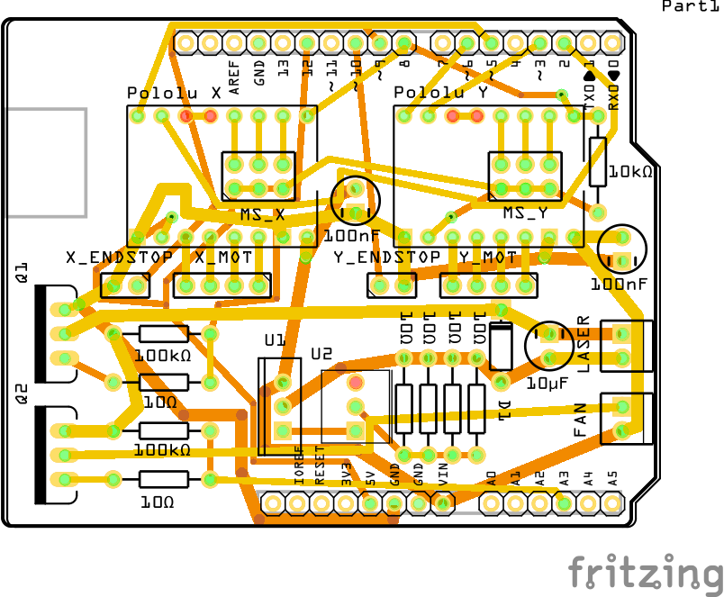

# MAUPS

**M**icroSlice **A**rduino **U**no **P**ololu **S**hield.

As it says on the tin, this a shield to aggregate all the electronics for the [MicroSlice laser cutter](http://www.instructables.com/id/MicroSlice-A-tiny-Arduino-laser-cutter/).

I wasn't happy with the default electronic design of the project because I felt it was overly complicated by the creator's choice of using mostly off the shelf parts.

There isn't many components but a lot of connections and that made for a messy setup.

This [schematic](http://thelittlebox.co/theforum/viewtopic.php?f=8&t=13&sid=64e7ffe73cd25b9ab61adbdb73844c2a#p58) will demonstrate the issue clearly.

## What I wasn't happy with

 * Reliance on wires instead of using a PCB
 * Unnecessary voltage regulators (not sure why it initially used a 5V fan)
 * Unnecessary relays where a MOSFET would do
 * Separate Laser drive
 * Easydrivers instead of Pololus (mostly a personal preference but also a tad cheaper).

## What does MAUPS provides

### PCB

This is a shield for the Arduino Uno with everything plugging into it.

 * The 2 Pololus, replacing the 2 external easydrivers
 * The fan, without the external relay board or its voltage regulator board (if 5V)
 * The laser, without it's driver board
 * The motors
 * The endstops

Everything uses male Dupont connectors except for the laser and fan that uses screw terminals.

### Laser driver

The power supply for the laser is built-in into the shield. It's also controlled by a MOSFET now.
The power supply is based around a LM317 and requires a beefy radiator.

### Fan control

The fan is also controlled by a MOSFET.

## Bill of Materials

| Amount | Part Type | Properties | Notes |
|--------|-----------|------------|-------|
| 2 | Electrolytic Capacitor | package 100 mil [THT, electrolytic]; capacitance 100nF; voltage 16V | |
| 1 | Electrolytic Capacitor | package 100 mil [THT, electrolytic]; capacitance 10µF; voltage 6.3V | |
| 1 | Rectifier Diode | package 300 mil [THT]; type Rectifier; part # 1N4001 | |
| 2 | Screw terminal - 2 pins | package THT; hole size 1.0mm,0.508mm; pins 2; pin spacing 0.1in (2.54mm) | |
| 4 | Generic single row female header - 8 pins | package THT; hole size 1.0mm,0.508mm; row double; form ♀ (female); pins 6; pin spacing 0.1in (2.54mm) | Pololus headers |
| 2 | Generic double row male header - 6 pins | package THT; hole size 1.0mm,0.508mm; row double; form ♂ (male); pins 6; pin spacing 0.1in (2.54mm) | Microstepping settings jumpers headers |
| 1 | Arduino Uno (Rev3) | type Arduino UNO (Rev3) | |
| 2 | Pololu A4988 | package SO16; chip label IC; variant variant 2 | |
| 2 | MOSFET-NCHANNEL | package to220v; variant pth2 | |
| 1 | 10k Ω Resistor | package THT; tolerance ±5%; bands 4; resistance 10kΩ; pin spacing 400 mil | |
| 6 | 10 Ω Resistor | package THT; tolerance ±5%; bands 4; resistance 10Ω; pin spacing 400 mil | |
| 1 | Trimmer Potentiometer | package THT; size Trimmer - 6mm; track Linear; type Trimmer Potentiometer; maximum resistance 100Ω | |
| 2 | 100k Ω Resistor | package THT; tolerance ±5%; bands 4; resistance 100kΩ; pin spacing 400 mil | |
| 1 | Voltage Regulator | package to220-adj; voltage 1.25 – 36 V; chip LM317; variant sink | |
| 2 | Male header - 2 pins | package THT; hole size 1.0mm,0.508mm; row single; form  ♂(male); pins 2; pin spacing 0.1in (2.54mm) | Stepper motors connectors|
| 2 | Male header - 4 pins | package THT; hole size 1.0mm,0.508mm; row single; form  ♂(male); pins 4; pin spacing 0.1in (2.54mm) | Endstop Connectors|

## To-do

 - [x] Prototype
 - [ ] Testing
 - [x] BOM
 - [ ] Assembly instruction
 - [ ] Publishing it on Fritzing and offering it up for sale

## Inspiration

 * [LOG](https://www.logre.eu/wiki/Micro_Découpeuse/Graveuse_Laser) Grenoble's hackerspace
 * [RAMPS](http://reprap.org/wiki/RAMPS_1.4) For the name and concept
 * And of course SilverJimmy for the design of the MicroSlice
